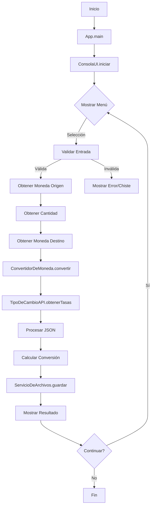

# Conversor de Monedas - README

[](https://www.exchangerate-api.com)
[](https://www.jetbrains.com/idea/)


## Índice

*[Título e imagen de portada](#🛠️-dependencias)

*[Insignias](#insignias)

*[Índice](#índice)

*[Descripción del proyecto](#descripción-del-proyecto)

*[Estado del proyecto](#Estado-del-proyecto)

## 📌 Descripción

El **Conversor de Monedas** es una aplicación Java que permite realizar conversiones entre diferentes divisas utilizando tasas de cambio actualizadas en tiempo real. La aplicación obtiene los datos de [Exchange Rate API](https://www.exchangerate-api.com/) y ofrece una interfaz de usuario intuitiva por línea de comandos.

## 🌟 Características principales

- Conversión entre 7 divisas diferentes (USD, MXN, ARS, BOB, BRL, CLP, COP)
- Tasas de cambio actualizadas en tiempo real
- Interfaz de usuario intuitiva por consola
- Historial de conversiones guardado en archivo JSON
- Validación de entradas del usuario
- Manejo de errores y conexión a internet

## 📋 Requisitos del sistema

- Java JDK 17 o superior
- Conexión a internet (para acceder a la API)
- Maven (opcional, para gestión de dependencias)

## 🛠️ Dependencias

- Gson (para el manejo de JSON)
- Java HttpClient (incluido en JDK 11+)

## Características Principales
✅ **HTTP/2 y WebSocket support**  
✅ **Asíncrono y Síncrono**  
✅ **Connection pooling**  
✅ **Soporte para HTTPS**  

## Uso en el Proyecto
```java
// Ejemplo de implementación
HttpClient client = HttpClient.newHttpClient();
HttpRequest request = HttpRequest.newBuilder()
      .uri(URI.create("https://api.example.com"))
      .build();

HttpResponse<String> response = client.send(
      request, 
      HttpResponse.BodyHandlers.ofString()
);
```
## 🚀 Cómo ejecutar el proyecto

1. **Clonar el repositorio**:

   ```bash
   git clone https://github.com/tu-usuario/ConversorDeMonedas.git
   cd ConversorDeMonedas
   ```

2. **Compilar el proyecto**:
   ```bash
   javac -d bin -cp "lib/gson-2.8.9.jar" src/ConversorDeMonedas/*.java src/ConversorDeMonedas/**/*.java
   ```

3. **Ejecutar la aplicación**:
   ```bash
   java -cp "bin;lib/gson-2.8.9.jar" ConversorDeMonedas.App
   ```
   (En Linux/Mac usar `:` en lugar de `;`)

## 🧭 Uso de la aplicación

1. Al iniciar la aplicación, se mostrará un menú con las monedas disponibles.
2. Selecciona la moneda de origen ingresando el número correspondiente.
3. Ingresa la cantidad a convertir (debe ser un número positivo).
4. Selecciona la moneda de destino.
5. La aplicación mostrará el resultado de la conversión.
6. Presiona Enter para realizar otra conversión o 'X' para salir.

>  La aplicacion te mostrara un chiste aleatorio al ingresar 3 veces erroneamente un valor en el menu de seleccionar moneda de origen. 
Al ingresar el numero 42 al seleccionar la moneda origen mostrara un mensaje (Easter Eggs). 
Al momento de ingresar el valor de 0 a la cantidad a convertir, tambien mostra un mensaje sarcastico. 
Al convertir la misma moneda, ejemplo: MXN a MXN, mostrara un mensaje sarcastico.


## 📂 Estructura del proyecto

```
ConversorDeMonedas/
├── api/
│   └── TipoDeCambioAPI.java         # Clase para interactuar con la API
├── modelo/
│   └── RespuestaTipoDeCambio.java    # Modelo para la respuesta de la API
├── servicios/
│   ├── ConvertidorDeMoneda.java      # Lógica de conversión
│   └── ServicioDeArchivos.java       # Manejo de archivos JSON
├── interfaz/
│   └── ConsolaUI.java                # Interfaz de usuario
└── App.java                          # Clase principal
```
### Diagrama de flujo



### Flujo Completo de la Aplicación

1. Inicialización:

- App.main() crea ConsolaUI

- ConsolaUI inicializa ConvertidorDeMoneda y ServicioDeArchivos

2. Interacción:

- Muestra menú con opciones numéricas

- Valida entradas del usuario

- Maneja errores con mensajes claros

3. Conversión:

- ConvertidorDeMoneda hace petición a API

- Procesa respuesta JSON con GSON

- Calcula conversión usando USD como base

4. Persistencia:

- ServicioDeArchivos guarda cada conversión

- Formato JSON legible con timestamp

5. Salida:

- Muestra resultados formateados

- Ofrece opción de continuar o salir

### Características Clave

1. Patrón Estratégico:

- Separación clara entre lógica, API e interfaz

- Fácil mantenimiento y extensibilidad

2. Manejo de Errores:

- Validación de entradas

- Mensajes claros para usuarios

- Recuperación elegante de fallos

3. Persistencia:

- Historial completo de operaciones

- Formato estandarizado (JSON)

4. Experiencia de Usuario:

- Interfaz intuitiva

- Retroalimentación inmediata

- Toques de humor en errores

## 📝 Archivo de resultados

Las conversiones realizadas se guardan en `resultadoConsulta.json` con el siguiente formato:

```json
{
  "fecha": "2023-11-15 14:30:45",
  "monedaOrigen": "MXN",
  "cantidad": 100.00,
  "monedaDestino": "USD",
  "resultado": 5.23
}
```

## ⚠️ Limitaciones

- La API gratuita tiene un límite de solicitudes por mes.
- Requiere conexión a internet para funcionar.
- Las tasas de cambio se actualizan una vez al día.


## ✉️ Contacto

Para preguntas o sugerencias, contacta al desarrollador:

[](mailto:cisco_red@outlook.com)
[](https://github.com/ciscored3507)
---

¡Gracias por usar el Conversor de Monedas! 💰
