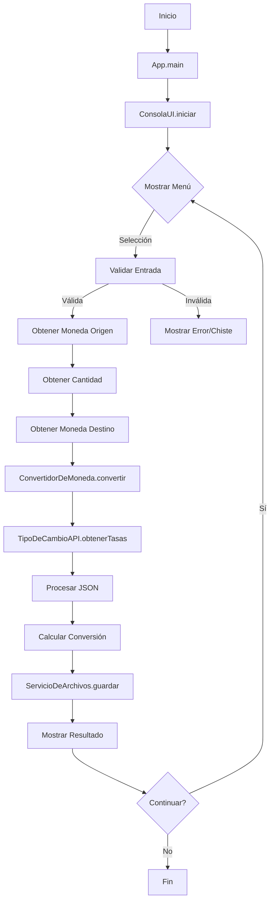

# Conversor de Monedas - README


## 📌 Descripción

El **Conversor de Monedas** es una aplicación Java que permite realizar conversiones entre diferentes divisas utilizando tasas de cambio actualizadas en tiempo real. La aplicación obtiene los datos de [Exchange Rate API](https://www.exchangerate-api.com/) y ofrece una interfaz de usuario intuitiva por línea de comandos.

## 🌟 Características principales

- Conversión entre 7 divisas diferentes (USD, MXN, ARS, BOB, BRL, CLP, COP)
- Tasas de cambio actualizadas en tiempo real
- Interfaz de usuario intuitiva por consola
- Historial de conversiones guardado en archivo JSON
- Validación de entradas del usuario
- Manejo de errores y conexión a internet

## 📋 Requisitos del sistema

- Java JDK 17 o superior
- Conexión a internet (para acceder a la API)
- Maven (opcional, para gestión de dependencias)

## 🛠️ Dependencias

- Gson (para el manejo de JSON)
- Java HttpClient (incluido en JDK 11+)

## Características Principales
✅ **HTTP/2 y WebSocket support**  
✅ **Asíncrono y Síncrono**  
✅ **Connection pooling**  
✅ **Soporte para HTTPS**  

## Uso en el Proyecto
```java
// Ejemplo de implementación
HttpClient client = HttpClient.newHttpClient();
HttpRequest request = HttpRequest.newBuilder()
      .uri(URI.create("https://api.example.com"))
      .build();

HttpResponse<String> response = client.send(
      request, 
      HttpResponse.BodyHandlers.ofString()
);
```
## 🚀 Cómo ejecutar el proyecto

1. **Abre Git bash**

Si aun no lo tienes instalado visita la pagina oficial de [Git](https://git-scm.com/downloads) para descargar e instalar.

3. **Abre la ubicación donde clonaras el repositorio**:
   Ejmplo:
   ```bash
   cd Documents
   ```
> Apoyate de `ls` para listar los archivos y directorios dentro de un directorio.
4. **Clonar el repositorio**:

   ```bash
   git clone https://github.com/ciscored3507/ConversorDeMonedas.git
   ```
2. **Abrir ubicación de la App**:
   ```bash
   cd ConversorDeMonedas
   ```

2. **Compilar el proyecto**:
   ```bash
   javac -d bin -cp "lib/gson-2.13.1.jar" src/ConversorDeMonedas/*.java src/ConversorDeMonedas/**/*.java
   ```

3. **Ejecutar la aplicación**:
   ```bash
   java -cp "bin;lib/gson-2.13.1.jar" ConversorDeMonedas.App
   ```

## 🧭 Uso de la aplicación

1. Al iniciar la aplicación, se mostrará un menú con las monedas disponibles.
```bash
 *************************************
|________Conversor de monedas_________|
|1. MXN - Peso mexicano               |
|2. ARS - Peso argentino              |
|3. BOB - Boliviano                   |
|4. BRL - Real brasileno              |
|5. CLP - Peso chileno                |
|6. COP - Peso colombiano             |
|7. USD - Dolar Estadounidense        |
|_____________________________________|
|X. Salir                             |
|_____________________________________|
Selecciona la moneda de entrada: 
```
2. Selecciona la moneda de origen ingresando el número correspondiente.
```bash 
 *************************************
|________Conversor de monedas_________|
|1. MXN - Peso mexicano               |
|2. ARS - Peso argentino              |
|3. BOB - Boliviano                   |
|4. BRL - Real brasileno              |
|5. CLP - Peso chileno                |
|6. COP - Peso colombiano             |
|7. USD - Dolar Estadounidense        |
|_____________________________________|
|X. Salir                             |
|_____________________________________|
Selecciona la moneda de entrada: 3
```
3. Ingresa la cantidad a convertir (debe ser un número positivo).
```bash
_______________________________________
Moneda Seleccionada: BOB - Boliviano
Ingresa la cantidad a convertir: 2000

```
4. Selecciona la moneda de destino.
```bash
 *************************************
|________Conversor de monedas_________|
|1. MXN - Peso mexicano               |
|2. ARS - Peso argentino              |
|3. BOB - Boliviano                   |
|4. BRL - Real brasileno              |
|5. CLP - Peso chileno                |
|6. COP - Peso colombiano             |
|7. USD - Dolar Estadounidense        |
|_____________________________________|
|X. Salir                             |
|_____________________________________|
Selecciona la moneda de salida: 7
```
5. La aplicación mostrará el resultado de la conversión.
```bash
Moneda Seleccionada: USD - Dolar Estadounidense
 *************************************
|_________Conversor de monedas________|
|         Conversion realizada!       |
|_____________________________________|
BOB - Boliviano : 2000.00
USD - Dolar Estadounidense : 288.80
|_____________________________________|
Presiona enter para continuar.
X para salir.
_______________________________________

```
6. Presiona Enter para realizar otra conversión o 'X' para salir.
```bash
Presiona enter para continuar.
X para salir.
_______________________________________

```

## Errores
### La aplicacion te mostrara un chiste aleatorio al ingresar 3 veces erroneamente un valor en el menu de seleccionar moneda de origen.
- Se ingresa valor Green
```bash
 *************************************
|________Conversor de monedas_________|
|1. MXN - Peso mexicano               |
|2. ARS - Peso argentino              |
|3. BOB - Boliviano                   |
|4. BRL - Real brasileno              |
|5. CLP - Peso chileno                |
|6. COP - Peso colombiano             |
|7. USD - Dolar Estadounidense        |
|_____________________________________|
|X. Salir                             |
|_____________________________________|
Selecciona la moneda de entrada: Green
```
- Se ingresa valor Duck
```bash
_______________________________________
Opcion no valida. Intente de nuevo.
 *************************************
|________Conversor de monedas_________|
|1. MXN - Peso mexicano               |
|2. ARS - Peso argentino              |
|3. BOB - Boliviano                   |
|4. BRL - Real brasileno              |
|5. CLP - Peso chileno                |
|6. COP - Peso colombiano             |
|7. USD - Dolar Estadounidense        |
|_____________________________________|
|X. Salir                             |
|_____________________________________|
Selecciona la moneda de entrada: Duck
```
- Se ingresa valor 0
```bash
_______________________________________
Opcion no valida. Intente de nuevo.
 *************************************
|________Conversor de monedas_________|
|1. MXN - Peso mexicano               |
|2. ARS - Peso argentino              |
|3. BOB - Boliviano                   |
|4. BRL - Real brasileno              |
|5. CLP - Peso chileno                |
|6. COP - Peso colombiano             |
|7. USD - Dolar Estadounidense        |
|_____________________________________|
|X. Salir                             |
|_____________________________________|
Selecciona la moneda de entrada: 0
```
- Mensaje
```bash
Ups! Parece que te cuesta elegir una opcion...
Aqui tienes un chiste para relajarte:
Tus intentos son como mis commits: 'prueba 1', 'prueba 2', 'a ver ahora'...
Intentalo de nuevo, esta vez con mas calma

_______________________________________
_______________________________________
Opcion no valida. Intente de nuevo.
```
- Se reinicia la Aplicación
```bash
 *************************************
|________Conversor de monedas_________|
|1. MXN - Peso mexicano               |
|2. ARS - Peso argentino              |
|3. BOB - Boliviano                   |
|4. BRL - Real brasileno              |
|5. CLP - Peso chileno                |
|6. COP - Peso colombiano             |
|7. USD - Dolar Estadounidense        |
|_____________________________________|
|X. Salir                             |
|_____________________________________|
Selecciona la moneda de entrada:

```
### Al ingresar el numero 42 tres veces en el menu de seleccionar moneda de entrada motrara un mensaje. (Easter Eggs).
- Se ingresa 3 veces el valor 42
```bash
_______________________________________
Opcion no valida. Intente de nuevo.
 *************************************
|________Conversor de monedas_________|
|1. MXN - Peso mexicano               |
|2. ARS - Peso argentino              |
|3. BOB - Boliviano                   |
|4. BRL - Real brasileno              |
|5. CLP - Peso chileno                |
|6. COP - Peso colombiano             |
|7. USD - Dolar Estadounidense        |
|_____________________________________|
|X. Salir                             |
|_____________________________________|
Selecciona la moneda de entrada: 42
```
- Mensaje
```bash
Correcto! Pero 42 es la respuesta al universo,
no a un conversor de monedas. Intenta con 1-7
_______________________________________
```
- Se reinicia la Aplicación
```bash
Opcion no valida. Intente de nuevo.
 *************************************
|________Conversor de monedas_________|
|1. MXN - Peso mexicano               |
|2. ARS - Peso argentino              |
|3. BOB - Boliviano                   |
|4. BRL - Real brasileno              |
|5. CLP - Peso chileno                |
|6. COP - Peso colombiano             |
|7. USD - Dolar Estadounidense        |
|_____________________________________|
|X. Salir                             |
|_____________________________________|
Selecciona la moneda de entrada:

```
Al momento de ingresar el valor de 0 a la cantidad a convertir, tambien mostra un mensaje sarcastico. 
- Selecciona la moneda de origen ingresando el número correspondiente.
```bash
 *************************************
|________Conversor de monedas_________|
|1. MXN - Peso mexicano               |
|2. ARS - Peso argentino              |
|3. BOB - Boliviano                   |
|4. BRL - Real brasileno              |
|5. CLP - Peso chileno                |
|6. COP - Peso colombiano             |
|7. USD - Dolar Estadounidense        |
|_____________________________________|
|X. Salir                             |
|_____________________________________|
Selecciona la moneda de entrada: 7
```
- Se ingresa valor 0
```bash
_______________________________________
Moneda Seleccionada: USD - Dolar Estadounidense
Ingresa la cantidad a convertir: 0
```
- Selecciona la moneda de destino.
```bash
 *************************************
|________Conversor de monedas_________|
|1. MXN - Peso mexicano               |
|2. ARS - Peso argentino              |
|3. BOB - Boliviano                   |
|4. BRL - Real brasileno              |
|5. CLP - Peso chileno                |
|6. COP - Peso colombiano             |
|7. USD - Dolar Estadounidense        |
|_____________________________________|
|X. Salir                             |
|_____________________________________|
Selecciona la moneda de salida: 5
```
- Mensaje
```bash
_______________________________________
Moneda Seleccionada: CLP - Peso chileno
_______________________________________
En serio!!!
Quieres convertir 0.00 USD (Dolar Estadounidense) a CLP (Peso chileno)?
Seguro que necesitabas un programa para saber que 0 es igual a 0?
Resultado: 0.0 ,implementacion perfecta, pero, para que?
Al menos esta conversion nunca tendra problemas de redondeo
_______________________________________
Presiona enter para continuar.
X para salir.
_______________________________________


```
### Al convertir la misma moneda, ejemplo: MXN a MXN, mostrara un mensaje sarcastico.  
- Selecciona la moneda de origen ingresando el número correspondiente.
```bash
 *************************************
|________Conversor de monedas_________|
|1. MXN - Peso mexicano               |
|2. ARS - Peso argentino              |
|3. BOB - Boliviano                   |
|4. BRL - Real brasileno              |
|5. CLP - Peso chileno                |
|6. COP - Peso colombiano             |
|7. USD - Dolar Estadounidense        |
|_____________________________________|
|X. Salir                             |
|_____________________________________|
Selecciona la moneda de entrada: 1
```
- Se ingresa valor 100
```bash
_______________________________________
Moneda Seleccionada: MXN - Peso mexicano
Ingresa la cantidad a convertir: 100
```
- Selecciona la moneda de destino.
```bash
 *************************************
|________Conversor de monedas_________|
|1. MXN - Peso mexicano               |
|2. ARS - Peso argentino              |
|3. BOB - Boliviano                   |
|4. BRL - Real brasileno              |
|5. CLP - Peso chileno                |
|6. COP - Peso colombiano             |
|7. USD - Dolar Estadounidense        |
|_____________________________________|
|X. Salir                             |
|_____________________________________|
Selecciona la moneda de salida: 1
```
- Mensaje
```bash
_______________________________________
Moneda Seleccionada: MXN - Peso mexicano
_______________________________________
En serio!!!
Quieres convertir 100.00 MXN (Peso mexicano) a MXN (Peso mexicano)?
Se convirtio correctamente
MXN - Peso mexicano : 100.00
MXN - Peso mexicano : 100.00
La app funciona, pero no era necesario
Al menos ya sabes que tienen el mismo valor
_______________________________________
Presiona enter para continuar.
X para salir.
_______________________________________
```


## 📂 Estructura del proyecto

```bash
ConversorDeMonedas/
├── api/
│   └── TipoDeCambioAPI.java          # Clase para interactuar con la API
├── modelo/
│   └── RespuestaTipoDeCambio.java    # Modelo para la respuesta de la API
├── servicios/
│   ├── ConvertidorDeMoneda.java      # Lógica de conversión
│   └── ServicioDeArchivos.java       # Manejo de archivos JSON
├── interfaz/
│   └── ConsolaUI.java                # Interfaz de usuario
└── App.java                          # Clase principal
```
### Diagrama de flujo



### Flujo Completo de la Aplicación

1. Inicialización:

- App.main() crea ConsolaUI

- ConsolaUI inicializa ConvertidorDeMoneda y ServicioDeArchivos

2. Interacción:

- Muestra menú con opciones numéricas

- Valida entradas del usuario

- Maneja errores con mensajes claros

3. Conversión:

- ConvertidorDeMoneda hace petición a API

- Procesa respuesta JSON con GSON

- Calcula conversión usando USD como base

4. Persistencia:

- ServicioDeArchivos guarda cada conversión

- Formato JSON legible con timestamp

5. Salida:

- Muestra resultados formateados

- Ofrece opción de continuar o salir

### Características Clave

1. Patrón Estratégico:

- Separación clara entre lógica, API e interfaz

- Fácil mantenimiento y extensibilidad

2. Manejo de Errores:

- Validación de entradas

- Mensajes claros para usuarios

- Recuperación elegante de fallos

3. Persistencia:

- Historial completo de operaciones

- Formato estandarizado (JSON)

4. Experiencia de Usuario:

- Interfaz intuitiva

- Retroalimentación inmediata

- Toques de humor en errores

## 📝 Archivo de resultados

Las conversiones realizadas se guardan en `resultadoConsulta.json` con el siguiente formato:

```json
{
  "fecha": "2023-11-15 14:30:45",
  "monedaOrigen": "MXN",
  "cantidad": 100.00,
  "monedaDestino": "USD",
  "resultado": 5.23
}
```

## ⚠️ Limitaciones

- La API gratuita tiene un límite de solicitudes por mes.
- Requiere conexión a internet para funcionar.
- Las tasas de cambio se actualizan una vez al día.


## ✉️ Contacto

Para preguntas o sugerencias, contacta al desarrollador:

[](mailto:cisco_red@outlook.com)
[](https://github.com/ciscored3507)
---

¡Gracias por usar el Conversor de Monedas! 💰

## Autor

| [<br><sub>Jose Francisco Toledo</sub>](https://github.com/ciscored3507) |
| :---: |
